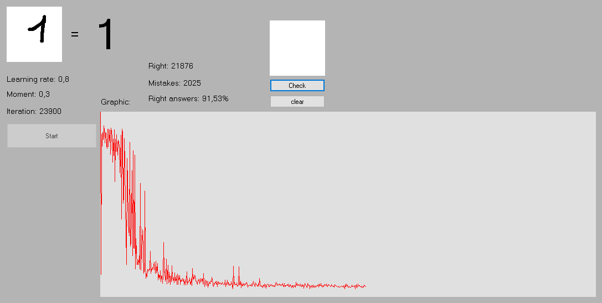
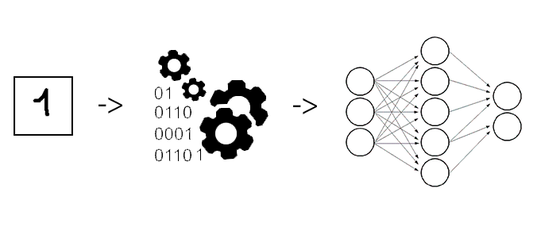

# ImageRecognition

## GUI

This is an example of using a neural network. The program recognizes images of numbers.



The left side of the program contains basic information about the neural network. It shows a graph of errors in real time. You can change the moment and learning rate in the program code.

After training, you can draw a number yourself and click `Сheck`.

## Dataset

The archive with the dataset should be next to the executable file. You can add more images to the dataset for greater accuracy. The archive contains 1000 images with numbers. During startup, the archive is unpacked, after the program terminates, the files are placed in the archive.

# Code

1. Unzip archive.

2. Get random image.

3. Learn neural network using image.

4. Get neural network error and draw graphic.

## Unzip archive

`DatasetZip.cs`

```csharp
struct DataElement
{
    public string[] pathes;
    public int num; // number in the picture

    public DataElement(string[] pathes, int num)
    {
        this.pathes = pathes;
        this.num = num;
    }
}

DataElement[] dataElements = new DataElement[10];

public void Extract()
{
    using (ZipArchive archive = ZipFile.OpenRead(pathToZip))
    {
        archive.ExtractToDirectory(folderName);
    }

    for (int i = 0; i <= 9; i++)
    {
        int num = i;
        string[] files = Directory.GetFiles($"dataset\\{num}");

        dataElements[i] = new DataElement(files, num);
    }
}


```

## Convert image to double array

Image must be `20x20` px. All images are black and white. White is converted to `0`, black to `1`.

```csharp
double[] CovertPicture(Bitmap bitmap)
{
    List<double> result = new List<double>(400);

    for (int i = 0; i < bitmap.Height; i++)
    {
        for (int j = 0; j < bitmap.Width; j++)
        {
            var pixel = bitmap.GetPixel(j, i);
            if (pixel == Color.FromArgb(255, 255, 255))
            {
                result.Add(0);
            }
            else
            {
                result.Add(1);
            }
        }
    }

    return result.ToArray();
}
```

## The result of learning iteration

`NeuralNetworkLearnResult.cs`

```csharp
public struct NeuralNetworkLearnResult
{
    public int AnswerExpected;
    public int AnswerActual;

    public double[] NeuronsOutput;
    public Neuron[] OutputNeurons;

    public NeuralNetworkLearnResult(int answerExpected, int answerActual, double[] output, Neuron[] neurons)
    {
        AnswerExpected = answerExpected;
        AnswerActual = answerActual;
        this.NeuronsOutput = output;
        OutputNeurons = neurons;
    }
}

```

## Iteration scheme




